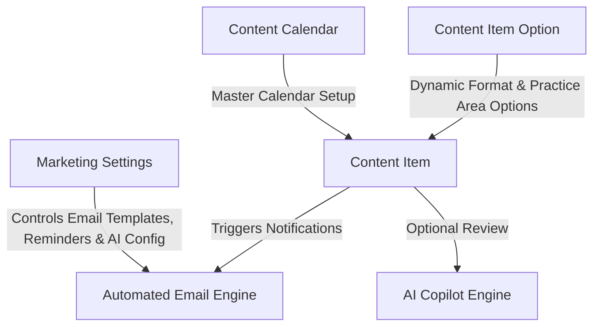

# ODA Marketing — Architecture & Operational Workflow

This document explains the current system architecture, data model, user roles, security scoping, and step-by-step operational workflow for the **ODA Marketing** application.

---

## 1. Overview & Core Architecture

The ODA Marketing platform manages the end-to-end lifecycle of enterprise marketing deliverables (Blogs, Polls, Flowcharts, Carousels, and custom dynamic formats). It provides structured planning, dynamic option management (`Content Item Option`), attachment requirement rules, multi-stage sequential reviews, mandatory feedback tracking, strict role permission controls, configurable SLA reminders, and automated AI Copilot evaluations.



---

## 2. Automatic App Hooks & Email Configuration

### Automatic Installation & Migration Setup
The app registers standard Frappe lifecycle hooks in [hooks.py](file:///home/user/frappe-bench/apps/oda_marketing/oda_marketing/hooks.py):
```python
after_install = "oda_marketing.setup_fixtures.run_setup"
after_migrate = "oda_marketing.setup_fixtures.run_setup"
```
Whenever `bench install-app oda_marketing` or `bench migrate` is run, all fixtures, default option records (`Content Item Option`), email templates, workflow states, kanban boards, and settings are automatically initialized without requiring manual command execution.

### `Marketing Settings` Single DocType
Includes operational switches, SLA reminder settings, and email templates:
- `writer_email_template` (`Marketing Writer Notification`)
- `reviewer_email_template` (`Marketing Reviewer Notification`)
- `publisher_email_template` (`Marketing Publisher Notification`)
- `published_email_template` (`Marketing Published Notification`)
- `overdue_sla_email_template` (`Marketing Overdue SLA Alert`)
- `default_publisher` (`Default Publisher / Marketing Lead`)
- `max_copilot_reviews_per_item` (Default: `3`)
- `sla_reminder_enabled` & `sla_reminder_days_before` (Default: `3` days)

---

## 3. Email Recipient, CC & Greeting Protocol

Access permissions and email dispatches use the exact user mapping matrix below. Every email template includes a direct CTA button link (`content_item_url`) pointing to the Content Item form in Desk:

| Workflow State | Recipient (`recipients`) | CC (`cc`) | Template Used | Greeting & Content |
| :--- | :--- | :--- | :--- | :--- |
| **`Briefed`** | Content Writer (`assigned_to`) | Deliverable Creator (`owner`) | `writer_email_template` | `"Hello {{ assigned_to_name }}"`, task instructions, planned publish date & Desk link |
| **`In Review`** | Reviewer (`reviewer_technical`) | Creator (`owner`), Writer, Default Publisher | `reviewer_email_template` | `"Hello {{ reviewer_technical_name }}"`, review request with draft & Desk links |
| **`In Revision`** | Content Writer (`assigned_to`) | Deliverable Creator (`owner`) | `writer_email_template` | `"Hello {{ assigned_to_name }}"`, revision requested with feedback notes & Desk link |
| **`Approved`** | Default Publisher (`default_publisher`) | Creator (`owner`), Content Writer (`assigned_to`) | `publisher_email_template` | `"Hello {{ publisher_name }}"`, deliverable approved for publishing & Desk link |
| **`Published`** | **Content Writer ONLY** (`assigned_to`) | None | `published_email_template` | `"Hello {{ assigned_to_name }}"`, congratulations email with live published URL & Desk link |
| **`Overdue SLA`** | Writer (`assigned_to`), Reviewer (`reviewer_technical`) | None | `overdue_sla_email_template` | Escalation alert with Due Date & Desk link |

> [!NOTE]
> `trigger_workflow_notifications()` and `trigger_system_notifications()` utilize `doc.flags.previous_workflow_state` prior to state mutations so that both manual transitions and automated AI Copilot evaluations reliably queue emails and in-app bell notifications.

---

## 4. DocType Data Model Summary

### 1. `Content Item Option` (Dynamic Setup DocType)
- **Purpose**: Decouples hardcoded dropdown choices for Format and Practice Area into a setup DocType.
- **Key Fields**:
  - `option_type` (*Format / Practice Area*).
  - `option_label` (e.g. *"Blog"*, *"HCLS"*).
  - `is_active` (Check, default `1`).
  - `sort_order` (Int, default `0`).

### 2. `Content Calendar` (Master Calendar Setup)
- **Purpose**: Defines active marketing operational periods (e.g. *"2026 Global Marketing Operations Calendar"*, Jan 1 – Dec 31). Modeled after Frappe HR's Holiday List.
- **Key Fields**: `calendar_name`, `from_date`, `to_date`, `status` (*Active / Inactive*), `description`.

### 3. `Content Item` (Core Deliverable)
- **Purpose**: The central tracking document for every blog, poll, flowchart, or carousel asset.
- **Key Fields**:
  - `title`, `content_type` (Link to `Content Item Option`, label *"Format"*), `topic`, `practice_area` (Link to `Content Item Option`).
  - `content_calendar`, `planned_publish_date`, `sla_due_date` (**Due Date**), `risk_flag` (**Risk Status**: *On track, At risk, Late*).
  - `assigned_to` (Writer), `reviewer_technical` (**Reviewer**).
  - `brief_accepted_on` (Datetime, read-only, stamped when writer starts work).
  - `status` / `workflow_state` (*Planned, Briefed, In Progress, In Review, In Revision, Approved, Published*).
  - **Draft Attachments (Allowed: Markdown .md, Images .png/.svg/.jpeg/.jpg/.webp, or Web Links. PDF/DOCX restricted)**:
    - `content_file_1` (Attach - **Primary Content Draft (Mandatory for Review & AI Copilot)**).
    - `content_file_2` (Attach - Supporting Asset 1 (Optional)).
    - `content_file_3` (Attach - Supporting Asset 2 (Optional)).
  - `revision_feedback_notes` (Mandatory notes required when requesting changes).
  - `reviewer_copilot_instructions` (Reviewer instructions for AI Copilot evaluation).
  - **AI Fields**: `ai_score`, `ai_review_status`, `ai_copilot_feedback`, `ai_generated_prompt`, `ai_reviews` (Child Table table for Copilot Review History).

---

## 5. Strict Role Permissions & Access Control Matrix

| Role | Creation & Deletion Rights | Field-Level Edit Permissions | File Attachment Access |
| :--- | :--- | :--- | :--- |
| **Marketing Lead** | Full (`create: 1, delete: 1`) | Full edit access to all metadata, calendar, options, and publishing fields. | Full View, Download & Replace. |
| **Default Publisher** | Full (`create: 1, delete: 1`) | Can view all deliverables and edit publishing details. | Full View & Download. |
| **Content Writer** | **Blocked** (`create: 0, delete: 0`) | Core metadata fields (including `due_date`) are **read-only**. Can edit draft attachments (`content_file_1/2/3`), notes, and transition states (`Start Work`, `Submit for Review`, `Resubmit Draft`). Read-only on draft files prior to `In Progress` state. | View, Download & Upload Draft Files (locked in `Planned` state). |
| **Technical Reviewer** | **Blocked** (`create: 0, delete: 0`) | Core metadata & draft attachments are **read-only**. Can edit `revision_feedback_notes`, `reviewer_copilot_instructions`, and transition states (`Approve`, `Request Changes`). | Full View & Download (Cannot Replace Writer Files). |

---

## 6. Workspace Sidebar Navigation Structure

```text
ODA Marketing
│
├── Content Execution
│   └── Content Item (Calendar & List Views)
│
└── Setup
    ├── Content Calendar (Master Calendar Setup)
    ├── Content Item Options (Format & Practice Area Dropdown Setup)
    ├── Marketing Settings (Email, Reminders & AI Copilot Configuration)
    └── Env Variables (Encrypted API Credentials)
```

---

## 7. Migration Patches Strategy (`patches/v1_1/`)

Migrations are executed deterministically via Frappe's patch system (`patches.txt` under `[post_model_sync]`):

1. **`create_content_item_options`**: Creates standard `Content Item Option` records for existing Format and Practice Area options, and migrates existing data without data loss.
2. **`rename_workflow_state_in_review`**: Renames all database rows with state `"In Review - Technical"` to `"In Review"`.
3. **`remove_sharepoint_field`**: Safely drops the `sharepoint_folder_url` database column and cleans up any custom fields.
