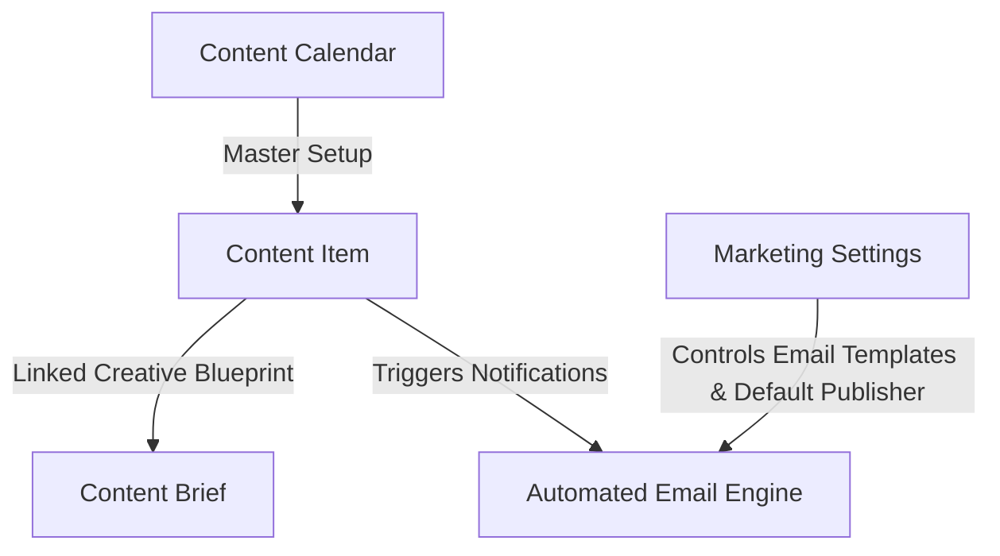
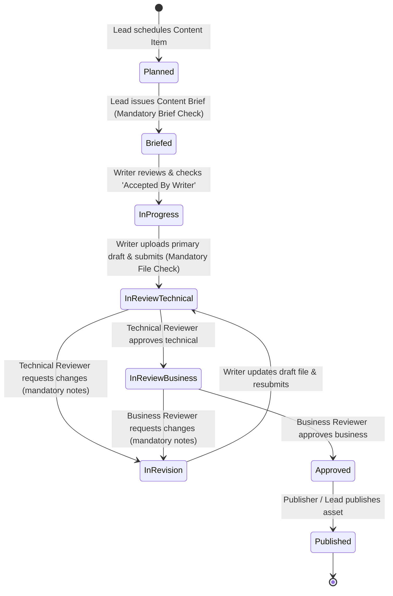

# ODA Marketing — Architecture & Operational Workflow

This document explains the current system architecture, data model, user roles, security scoping, and step-by-step operational workflow for the **ODA Marketing** application.

---

## 1. Overview & Core Architecture

The ODA Marketing platform manages the end-to-end lifecycle of enterprise marketing deliverables (Blogs, Polls, Flowcharts, Carousels). It provides structured planning, mandatory content brief gates, automatic brief-to-item mapping, unbriefed dropdown filters, attachment requirement rules, multi-stage sequential reviews, mandatory feedback tracking, strict role permission controls, default publisher settings, and automated SLA email alerts.



---

## 2. Designated Approvers & Publisher Configuration

The default operational roles are assigned to the following designated team email accounts:

- **Technical Reviewer**: `Avishkar.Kabadi@optimumdataanalytics.com` (Avishkar Kabadi)
- **Business Reviewer**: `vishwajeet.borade@optimumdataanalytics.com` (Vishwajeet Borade)
- **Default Publisher**: `Mrudula.Saradar@optimumdataanalytics.com` (Mrudula Saradar)

### Automatic Name Parsing (`firstname.lastname`)
The email engine dynamically extracts human-readable names (`"Firstname Lastname"`) from user accounts or parses `firstname.lastname@domain.com` email strings as a fallback, ensuring every email greeting and status line renders full human names instead of raw system IDs or generic placeholders.

---

## 3. DocType Data Model Summary

### 1. `Content Calendar` (Master Setup)
- **Purpose**: Defines active marketing operational periods (e.g. *"2026 Global Marketing Calendar"*, Jan 1 – Dec 31). Modeled after Frappe HR's Holiday List.
- **Key Fields**: `calendar_name`, `from_date`, `to_date`, `status` (*Active / Inactive*), `description`.

### 2. `Content Item` (Core Deliverable)
- **Purpose**: The central tracking document for every blog, poll, flowchart, or carousel asset.
- **Key Fields**:
  - `title`, `content_type`, `topic`, `practice_area` (*HCLS, Pharma, Fintech, AgTech, Cross-domain*).
  - `content_calendar`, `planned_publish_date`, `sla_due_date`, `risk_flag` (*On track, At risk, Late*).
  - `assigned_to` (Writer), `reviewer_technical` (SME), `reviewer_business` (Marketing Manager).
  - `status` / `workflow_state` (*Planned, Briefed, In Progress, In Review - Technical, In Review - Business, In Revision, Approved, Published*).
  - **Writer's Attachment Slots**:
    - `content_file_1` (Attach - **Primary Content Draft (Mandatory for Review)**).
    - `content_file_2` (Attach - Writer's Supporting Asset 1 (Optional)).
    - `content_file_3` (Attach - Writer's Supporting Asset 2 (Optional)).
  - `revision_feedback_notes` (Mandatory notes required when requesting changes).

### 3. `Content Brief` (Creative Blueprint)
- **Purpose**: Creative instructions and SEO guidelines created by the Marketing Lead for the writer.
- **Automatic Database Write-Back**: Saving a `Content Brief` automatically writes its ID back to `Content Item.content_brief` in MariaDB via Python controller.
- **Unbriefed Item Filter**: Creating a brief from the Content Brief tab filters the dropdown to show **ONLY Content Items without a brief yet**.
- **Auto-Redirect Flow**: Saving a brief automatically alerts the user and redirects back to the `Content Item` form so the Marketing Lead can click **`Issue Brief`**.
- **1 Brief Rule**: Only 1 `Content Brief` can exist per `Content Item`.
- **Key Fields**: `content_item` (Link), `outline` (Rich text editor), `target_audience`, `primary_keyword`, `word_target`, `accepted_by_writer` (Check), `accepted_on` (Datetime).

### 4. `Marketing Settings` (Central Configuration)
- **Purpose**: Single DocType accessible under **Setup** in the workspace sidebar to configure global defaults, default publisher, and email templates.
- **Key Fields**:
  - `enable_email_notifications` (Checkbox master switch).
  - `default_publisher` (`Mrudula.Saradar@optimumdataanalytics.com`).
  - `writer_email_template` (Link: Email Template for assignments & revisions).
  - `reviewer_email_template` (Link: Email Template for technical & business reviews).
  - `publisher_email_template` (Link: Email Template for final approval & publishing).
  - `overdue_sla_email_template` (Link: Email Template for late SLA alerts).

---

## 4. Strict Role Permissions & Access Control Matrix

Access permissions are enforced dynamically in `permissions.py` (record level), `content_item.py` (server validation), and `content_item.js` (client form control):

| Role | Creation & Deletion Rights | Field-Level Edit Permissions | File Attachment Access |
| :--- | :--- | :--- | :--- |
| **Marketing Lead** | Full (`create: 1, delete: 1`) | Full edit access to all metadata, calendar, and publishing fields. | Full View, Download & Replace. |
| **Default Publisher** | Full (`create: 1, delete: 1`) | Can view all deliverables and edit publishing details. | Full View & Download. |
| **Content Writer** | **Blocked** (`create: 0, delete: 0`) | Core metadata fields are **read-only**. Can ONLY upload/edit draft attachments (`content_file_1`, `content_file_2`, `content_file_3`), add notes, check `accepted_by_writer` on brief, and transition state to `In Review`. | View, Download & Upload Draft Files. |
| **Technical Reviewer** | **Blocked** (`create: 0, delete: 0`) | Core metadata & draft attachments are **read-only**. Can ONLY edit `revision_feedback_notes` when requesting changes and transition states (`Approve Technical`, `Request Changes`). | Full View & Download (Cannot Replace Writer Files). |
| **Business Reviewer** | **Blocked** (`create: 0, delete: 0`) | Core metadata & draft attachments are **read-only**. Can ONLY edit `revision_feedback_notes` when requesting changes and transition states (`Approve Business`, `Request Changes`). | Full View & Download (Cannot Replace Writer Files). |

---

## 5. End-to-End Operational Workflow & Email Recipient Rules

The following state machine governs every deliverable from planning to publishing:



### Detailed Notification Dispatch Protocol:

1. **Briefing (`Planned` → `Briefed`)**:
   - Recipient: **Content Writer** (`assigned_to`).
   - Email: Informs writer of assignment, planned publish date, and instructions to accept Content Brief.

2. **Technical Review Submission (`In Progress` → `In Review - Technical`)**:
   - Recipients: **Technical Reviewer** (`Avishkar.Kabadi@optimumdataanalytics.com`), CC **Business Reviewer**.
   - Email: Contains writer name, SLA due date, and clickable HTML links for populated attachment drafts.

3. **Technical Review Approval (`In Review - Technical` → `In Review - Business`)**:
   - Recipients: **Business Reviewer** (`vishwajeet.borade@optimumdataanalytics.com`) AND **Content Writer** (`assigned_to`).
   - Email: Notifies writer that Technical Review passed and informs Business Reviewer to review the item.

4. **Revision Requested (`In Review` → `In Revision`)**:
   - Recipient: **Content Writer** (`assigned_to`).
   - Email: Displays reviewer feedback notes and link to draft file.

5. **Business Review Approval (`In Review - Business` → `Approved`)**:
   - Recipients: **Default Publisher** (`Mrudula.Saradar@optimumdataanalytics.com`) AND **Content Writer** (`assigned_to`).
   - Email: Notifies writer and publisher that deliverable is fully approved.

6. **Publishing (`Approved` → `Published`)**:
   - Recipients: **Content Writer** (`assigned_to`) AND **Default Publisher** (`Mrudula.Saradar@optimumdataanalytics.com`).
   - Email: Notifies writer and publisher with live published URL link.

---

## 6. Workspace Sidebar Navigation Structure

```text
ODA Marketing
│
├── Content Execution
│   ├── Content Item (Calendar & List Views)
│   └── Content Brief
│
└── Setup
    ├── Content Calendar (Master Calendar Setup)
    └── Marketing Settings (Email, Publisher & Template Configuration)
```
