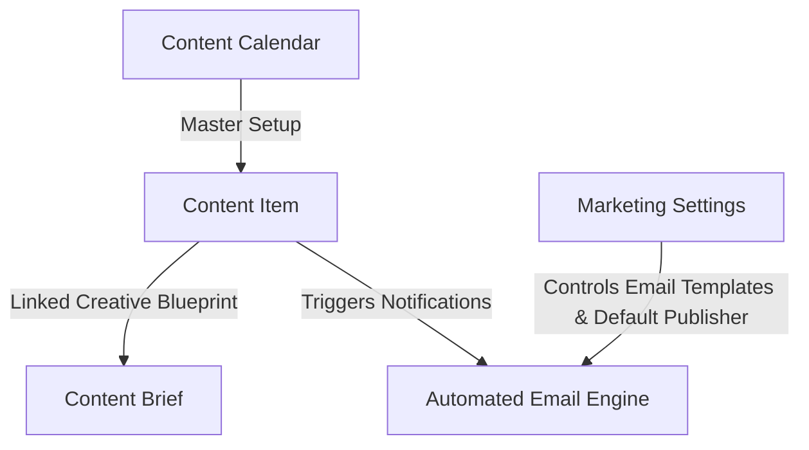

# ODA Marketing — Architecture & Operational Workflow

This document explains the current system architecture, data model, user roles, security scoping, and step-by-step operational workflow for the **ODA Marketing** application.

---

## 1. Overview & Core Architecture

The ODA Marketing platform manages the end-to-end lifecycle of enterprise marketing deliverables (Blogs, Polls, Flowcharts, Carousels). It provides structured planning, mandatory content brief gates, automatic brief-to-item mapping, unbriefed dropdown filters, attachment requirement rules, multi-stage sequential reviews, mandatory feedback tracking, strict role permission controls, default publisher settings, and automated SLA email alerts.



---

## 2. Automatic App Hooks & Email Configuration

### Automatic Installation & Migration Setup
The app registers standard Frappe lifecycle hooks in [hooks.py](file:///home/user/frappe-bench/apps/oda_marketing/oda_marketing/hooks.py):
```python
after_install = "oda_marketing.setup_fixtures.run_setup"
after_migrate = "oda_marketing.setup_fixtures.run_setup"
```
Whenever `bench install-app oda_marketing` or `bench migrate` is run, all fixtures, email templates, workflow states, and settings are automatically initialized without requiring manual command execution.

### `Marketing Settings` Single DocType
Includes 5 customizable template fields:
- `writer_email_template` (`Marketing Writer Notification`)
- `reviewer_email_template` (`Marketing Reviewer Notification`)
- `publisher_email_template` (`Marketing Publisher Notification`)
- `published_email_template` (`Marketing Published Notification` - New)
- `overdue_sla_email_template` (`Marketing Overdue SLA Alert`)
- `default_publisher` (`Mrudula.Saradar@optimumdataanalytics.com`)

---

## 3. Email Recipient, CC & Greeting Protocol

Access permissions and email dispatches use the exact user mapping matrix below:

| Workflow State | Recipient (`recipients`) | CC (`cc`) | Template Used | Greeting & Content |
| :--- | :--- | :--- | :--- | :--- |
| **`Briefed`** | Content Writer (`assigned_to`) | Deliverable Creator (`owner`) | `writer_email_template` | `"Hello {{ assigned_to_name }}"`, brief review instructions & planned publish date |
| **`In Review - Technical`** | Technical Reviewer (`reviewer_technical`) | Business Reviewer, Creator (`owner`), Default Publisher | `reviewer_email_template` | `"Hello {{ reviewer_technical_name }}"`, technical review request with draft links |
| **`In Review - Business`** | Business Reviewer (`reviewer_business`) | Default Publisher, Creator (`owner`), Content Writer (`assigned_to`) | `reviewer_email_template` | `"Hello {{ reviewer_business_name }}"`, business review request with draft links |
| **`In Revision`** | Content Writer (`assigned_to`) | Deliverable Creator (`owner`) | `writer_email_template` | `"Hello {{ assigned_to_name }}"`, revision requested with feedback notes |
| **`Approved`** | Default Publisher (`default_publisher`) | Creator (`owner`), Content Writer (`assigned_to`) | `publisher_email_template` | `"Hello {{ publisher_name }}"`, deliverable approved for publishing |
| **`Published`** | **Content Writer ONLY** (`assigned_to`) | None | `published_email_template` | `"Hello {{ assigned_to_name }}"`, congratulations email with live published URL |

---

## 4. DocType Data Model Summary

### 1. `Content Calendar` (Master Setup)
- **Purpose**: Defines active marketing operational periods (e.g. *"2026 Global Marketing Calendar"*, Jan 1 – Dec 31). Modeled after Frappe HR's Holiday List.
- **Key Fields**: `calendar_name`, `from_date`, `to_date`, `status` (*Active / Inactive*), `description`.

### 2. `Content Item` (Core Deliverable)
- **Purpose**: The central tracking document for every blog, poll, flowchart, or carousel asset.
- **Key Fields**:
  - `title`, `content_type`, `topic`, `practice_area` (*HCLS, Pharma, Fintech, AgTech, Cross-domain*).
  - `content_calendar`, `planned_publish_date`, `sla_due_date`, `risk_flag` (*On track, At risk, Late*).
  - `assigned_to` (Writer), `reviewer_technical` (SME), `reviewer_business` (Marketing Manager).
  - `status` / `workflow_state` (*Planned, Briefed, In Progress, In Review - Technical, In Review - Business, In Revision, Approved, Published*).
  - **Writer's Attachment Slots**:
    - `content_file_1` (Attach - **Primary Content Draft (Mandatory for Review)**).
    - `content_file_2` (Attach - Writer's Supporting Asset 1 (Optional)).
    - `content_file_3` (Attach - Writer's Supporting Asset 2 (Optional)).
  - `revision_feedback_notes` (Mandatory notes required when requesting changes).

### 3. `Content Brief` (Creative Blueprint)
- **Purpose**: Creative instructions and SEO guidelines created by the Marketing Lead for the writer.
- **Automatic Database Write-Back**: Saving a `Content Brief` automatically writes its ID back to `Content Item.content_brief` in MariaDB via Python controller.
- **Unbriefed Item Filter**: Creating a brief from the Content Brief tab filters the dropdown to show **ONLY Content Items without a brief yet**.
- **Auto-Redirect Flow**: Saving a brief automatically alerts the user and redirects back to the `Content Item` form so the Marketing Lead can click **`Issue Brief`**.
- **1 Brief Rule**: Only 1 `Content Brief` can exist per `Content Item`.
- **Key Fields**: `content_item` (Link), `outline` (Rich text editor), `target_audience`, `primary_keyword`, `word_target`, `accepted_by_writer` (Check), `accepted_on` (Datetime).

---

## 5. Strict Role Permissions & Access Control Matrix

| Role | Creation & Deletion Rights | Field-Level Edit Permissions | File Attachment Access |
| :--- | :--- | :--- | :--- |
| **Marketing Lead** | Full (`create: 1, delete: 1`) | Full edit access to all metadata, calendar, and publishing fields. | Full View, Download & Replace. |
| **Default Publisher** | Full (`create: 1, delete: 1`) | Can view all deliverables and edit publishing details. | Full View & Download. |
| **Content Writer** | **Blocked** (`create: 0, delete: 0`) | Core metadata fields are **read-only**. Can ONLY upload/edit draft attachments (`content_file_1`, `content_file_2`, `content_file_3`), add notes, check `accepted_by_writer` on brief, and transition state to `In Review`. | View, Download & Upload Draft Files. |
| **Technical Reviewer** | **Blocked** (`create: 0, delete: 0`) | Core metadata & draft attachments are **read-only**. Can ONLY edit `revision_feedback_notes` when requesting changes and transition states (`Approve Technical`, `Request Changes`). | Full View & Download (Cannot Replace Writer Files). |
| **Business Reviewer** | **Blocked** (`create: 0, delete: 0`) | Core metadata & draft attachments are **read-only**. Can ONLY edit `revision_feedback_notes` when requesting changes and transition states (`Approve Business`, `Request Changes`). | Full View & Download (Cannot Replace Writer Files). |

---

## 6. Workspace Sidebar Navigation Structure

```text
ODA Marketing
│
├── Content Execution
│   ├── Content Item (Calendar & List Views)
│   └── Content Brief
│
└── Setup
    ├── Content Calendar (Master Calendar Setup)
    └── Marketing Settings (Email, Publisher & Template Configuration)
```
