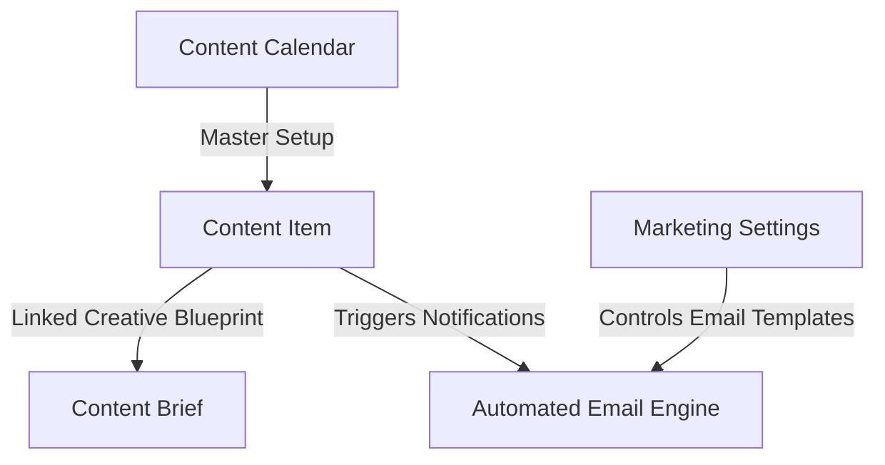
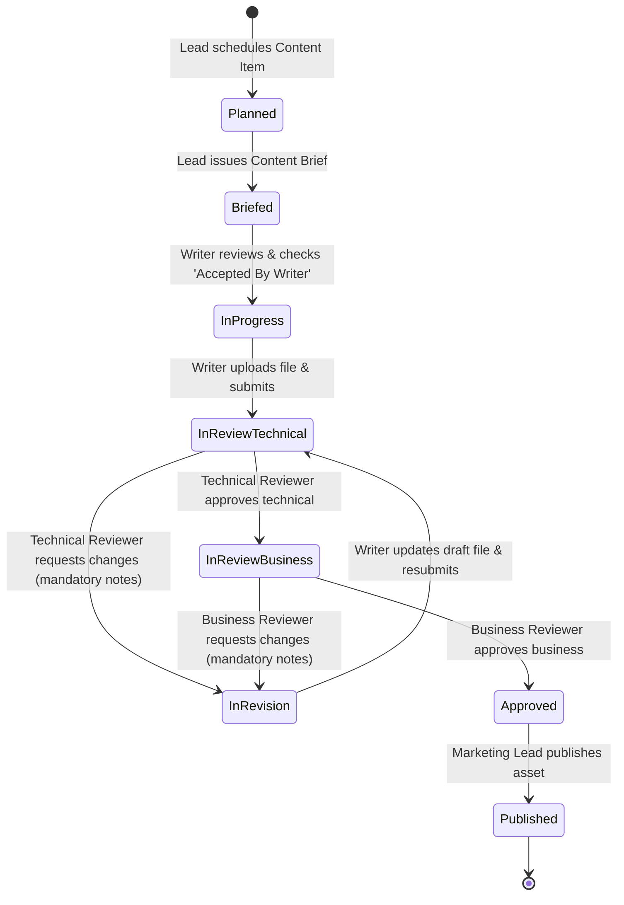

# ODA Marketing — Architecture & Operational Workflow

This document explains the current system architecture, data model, user roles, security scoping, and step-by-step operational workflow for the **ODA Marketing** application.

---

## 1. Overview & Core Architecture

The ODA Marketing platform manages the end-to-end lifecycle of enterprise marketing deliverables (Blogs, Polls, Flowcharts, Carousels). It provides structured planning, content brief acceptance gates, multi-stage sequential reviews, mandatory feedback tracking, involvement-based access security, and automated SLA email alerts.



---

## 2. DocType Data Model Summary

### 1. `Content Calendar` (Master Setup)
- **Purpose**: Defines active marketing operational periods (e.g. *"2026 Global Marketing Calendar"*, Jan 1 – Dec 31). Modeled after Frappe HR's Holiday List.
- **Key Fields**: `calendar_name`, `from_date`, `to_date`, `status` (*Active / Inactive*), `description`.

### 2. `Content Item` (Core Deliverable)
- **Purpose**: The central tracking document for every blog, poll, flowchart, or carousel asset.
- **Key Fields**:
  - `title`, `content_type`, `topic`, `practice_area` (*HCLS, Pharma, Fintech, AgTech, Cross-domain*).
  - `content_calendar`, `planned_publish_date`, `sla_due_date`, `risk_flag` (*On track, At risk, Late*).
  - `assigned_to` (Writer), `reviewer_technical` (SME), `reviewer_business` (Marketing Manager).
  - `status` / `workflow_state` (*Planned, Briefed, In Progress, In Review - Technical, In Review - Business, In Revision, Approved, Published*).
  - `content_file` (Attach field for PDF, DOCX, Image, TXT draft files).
  - `revision_feedback_notes` (Mandatory notes required when requesting changes).

### 3. `Content Brief` (Creative Blueprint)
- **Purpose**: Creative instructions and SEO guidelines created by the Marketing Lead for the writer.
- **Key Fields**: `content_item` (Link), `outline` (Rich text editor), `target_audience`, `primary_keyword`, `word_target`, `accepted_by_writer` (Check), `accepted_on` (Datetime).

### 4. `Marketing Settings` (Central Configuration)
- **Purpose**: Single DocType accessible under **Setup** in the workspace sidebar to configure global defaults and email templates.
- **Key Fields**:
  - `enable_email_notifications` (Checkbox master switch).
  - `writer_email_template` (Link: Email Template for assignments/revisions).
  - `reviewer_email_template` (Link: Email Template for technical/business reviews).
  - `publisher_email_template` (Link: Email Template for final approval & publishing).
  - `overdue_sla_email_template` (Link: Email Template for late SLA alerts).

---

## 3. User Roles & Security Scoping

Access permissions are enforced dynamically in `permissions.py` so users only see items relevant to their role:

| Role | Permissions & Visible Scope |
| :--- | :--- |
| **Marketing Lead** | Full access to all DocTypes, calendars, settings, issuing briefs, and publishing assets. |
| **Content Writer** | **Strict Involvement Scoping**: Sees ONLY items where `assigned_to == user` (or `owner == user`). Accepts briefs, uploads draft files, and resubmits revisions. |
| **Technical Reviewer** | **Strict Involvement Scoping**: Sees ONLY items where `reviewer_technical == user`. Reviews technical drafts, enters revision notes, or approves technical stage. |
| **Business Reviewer** | **Strict Involvement Scoping**: Sees ONLY items where `reviewer_business == user`. Reviews business positioning, enters revision notes, or approves business stage. |

---

## 4. End-to-End Operational Workflow

The following state machine governs every deliverable from planning to publishing:



### Detailed Step-by-Step Flow:

1. **Scheduling (`Planned`)**:
   - The Marketing Lead creates a `Content Item` on the calendar grid, assigning a Writer, Technical Reviewer, and Business Reviewer.

2. **Briefing (`Planned` → `Briefed`)**:
   - The Lead creates a linked `Content Brief` (outline, keywords, target audience) and clicks **`Issue Brief`**.

3. **Acceptance (`Briefed` → `In Progress`)**:
   - The assigned Writer opens the `Content Brief`, reviews the guidelines, and checks **`Accepted By Writer`**. This automatically advances the item to **`In Progress`**.

4. **Technical Review Submission (`In Progress` → `In Review - Technical`)**:
   - The Writer completes the draft, uploads the file into `content_file` (PDF/Word/Image), and clicks **`Submit for Technical Review`**.
   - An automated email notification is sent to the Technical Reviewer using `reviewer_email_template`.

5. **Technical Review Signoff or Revision**:
   - **If Revision Needed**: Technical Reviewer enters notes into `revision_feedback_notes` and clicks **`Request Changes`** → State becomes **`In Revision`** (Triggers email to Writer with feedback notes).
   - **If Technical Approved**: Technical Reviewer clicks **`Approve Technical`** → State becomes **`In Review - Business`** (Triggers email to Business Reviewer).

6. **Business Review Signoff**:
   - Business Reviewer reviews the deliverable and clicks **`Approve Business`** → State becomes **`Approved`** (Triggers email to Marketing Lead).

7. **Publishing (`Approved` → `Published`)**:
   - The Marketing Lead enters `published_url` and clicks **`Publish`**. State becomes **`Published`**.

---

## 5. Automated SLA & Overdue Alert Engine

- Every `Content Item` calculates an `sla_due_date` based on `content_type` (e.g. 30 days before publish date for Blogs, 14 days for Flowcharts/Carousels, 7 days for Polls).
- A daily automated job evaluates items past `sla_due_date`:
  - Sets `risk_flag = "Late"`.
  - Dispatches an urgent email alert to the Writer, Technical Reviewer, Business Reviewer, and Lead using `overdue_sla_email_template`.

---

## 6. Workspace Sidebar Navigation Structure

```text
ODA Marketing
│
├── Content Execution
│   ├── Content Item (Calendar & List Views)
│   └── Content Brief
│
└── Setup
    ├── Content Calendar (Master Calendar Setup)
    └── Marketing Settings (Email & Template Configuration)
```
