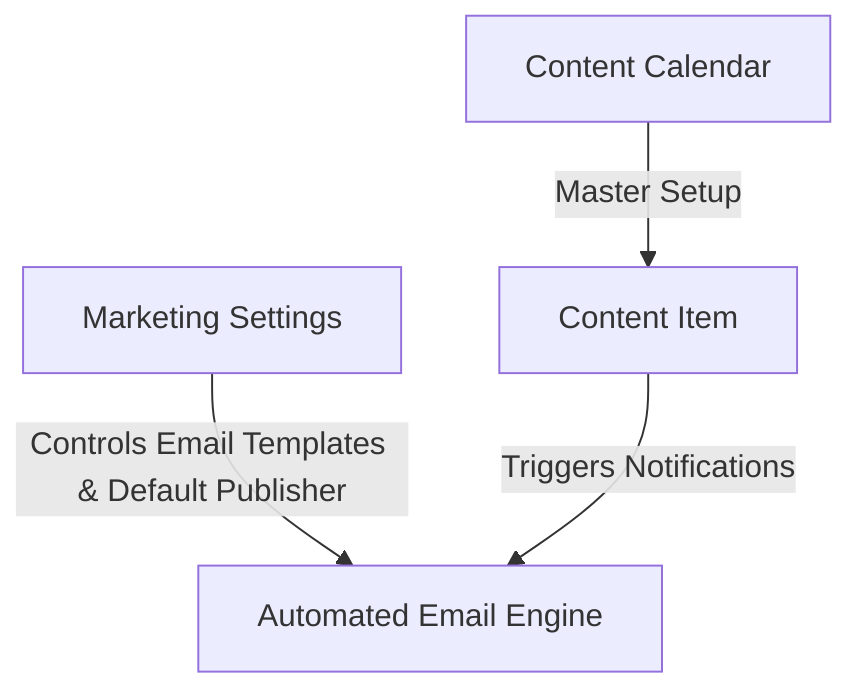

# ODA Marketing — Architecture & Operational Workflow

This document explains the current system architecture, data model, user roles, security scoping, and step-by-step operational workflow for the **ODA Marketing** application.

---

## 1. Overview & Core Architecture

The ODA Marketing platform manages the end-to-end lifecycle of enterprise marketing deliverables (Blogs, Polls, Flowcharts, Carousels). It provides structured planning, attachment requirement rules, multi-stage sequential reviews, mandatory feedback tracking, strict role permission controls, default publisher settings, and automated SLA email alerts.



---

## 2. Automatic App Hooks & Email Configuration

### Automatic Installation & Migration Setup
The app registers standard Frappe lifecycle hooks in [hooks.py](file:///home/user/frappe-bench/apps/oda_marketing/oda_marketing/hooks.py):
```python
after_install = "oda_marketing.setup_fixtures.run_setup"
after_migrate = "oda_marketing.setup_fixtures.run_setup"
```
Whenever `bench install-app oda_marketing` or `bench migrate` is run, all fixtures, email templates, workflow states, and settings are automatically initialized without requiring manual command execution.

### `Marketing Settings` Single DocType
Includes 5 customizable template fields:
- `writer_email_template` (`Marketing Writer Notification`)
- `reviewer_email_template` (`Marketing Reviewer Notification`)
- `publisher_email_template` (`Marketing Publisher Notification`)
- `published_email_template` (`Marketing Published Notification` - New)
- `overdue_sla_email_template` (`Marketing Overdue SLA Alert`)
- `default_publisher` (`Mrudula.Saradar@optimumdataanalytics.com`)

---

## 3. Email Recipient, CC & Greeting Protocol

Access permissions and email dispatches use the exact user mapping matrix below:

| Workflow State | Recipient (`recipients`) | CC (`cc`) | Template Used | Greeting & Content |
| :--- | :--- | :--- | :--- | :--- |
| **`Briefed`** | Content Writer (`assigned_to`) | Deliverable Creator (`owner`) | `writer_email_template` | `"Hello {{ assigned_to_name }}"`, task instructions & planned publish date |
| **`In Review - Technical`** | Technical Reviewer (`reviewer_technical`) | Creator (`owner`), Default Publisher | `reviewer_email_template` | `"Hello {{ reviewer_technical_name }}"`, technical review request with draft links |
| **`In Revision`** | Content Writer (`assigned_to`) | Deliverable Creator (`owner`) | `writer_email_template` | `"Hello {{ assigned_to_name }}"`, revision requested with feedback notes |
| **`Approved`** | Default Publisher (`default_publisher`) | Creator (`owner`), Content Writer (`assigned_to`) | `publisher_email_template` | `"Hello {{ publisher_name }}"`, deliverable approved for publishing |
| **`Published`** | **Content Writer ONLY** (`assigned_to`) | None | `published_email_template` | `"Hello {{ assigned_to_name }}"`, congratulations email with live published URL |

---

## 3. Email Recipient, CC & Greeting Protocol

Access permissions and email dispatches use the exact user mapping matrix below. Every email template includes a direct CTA button link (`content_item_url`) pointing to the Content Item form in Desk:

| Workflow State | Recipient (`recipients`) | CC (`cc`) | Template Used | Greeting & Content |
| :--- | :--- | :--- | :--- | :--- |
| **`Briefed`** | Content Writer (`assigned_to`) | Deliverable Creator (`owner`) | `writer_email_template` | `"Hello {{ assigned_to_name }}"`, task instructions, planned publish date & Desk link |
| **`In Review - Technical`** | Technical Reviewer (`reviewer_technical`) | Creator (`owner`), Writer, Default Publisher | `reviewer_email_template` | `"Hello {{ reviewer_technical_name }}"`, technical review request with draft & Desk links |
| **`In Revision`** | Content Writer (`assigned_to`) | Deliverable Creator (`owner`) | `writer_email_template` | `"Hello {{ assigned_to_name }}"`, revision requested with feedback notes & Desk link |
| **`Approved`** | Default Publisher (`default_publisher`) | Creator (`owner`), Content Writer (`assigned_to`) | `publisher_email_template` | `"Hello {{ publisher_name }}"`, deliverable approved for publishing & Desk link |
| **`Published`** | **Content Writer ONLY** (`assigned_to`) | None | `published_email_template` | `"Hello {{ assigned_to_name }}"`, congratulations email with live published URL & Desk link |
| **`Overdue SLA`** | Writer (`assigned_to`), Reviewer (`reviewer_technical`) | None | `overdue_sla_email_template` | Escalation alert with SLA Due Date & Desk link |

> [!NOTE]
> `trigger_workflow_notifications()` and `trigger_system_notifications()` utilize `doc.flags.previous_workflow_state` prior to state mutations so that both manual transitions and automated AI Copilot evaluations reliably queue emails and in-app notifications.

---

## 4. DocType Data Model Summary

### 1. `Content Calendar` (Master Setup)
- **Purpose**: Defines active marketing operational periods (e.g. *"2026 Global Marketing Calendar"*, Jan 1 – Dec 31). Modeled after Frappe HR's Holiday List.
- **Key Fields**: `calendar_name`, `from_date`, `to_date`, `status` (*Active / Inactive*), `description`.

### 2. `Content Item` (Core Deliverable)
- **Purpose**: The central tracking document for every blog, poll, flowchart, or carousel asset.
- **Key Fields**:
  - `title`, `content_type`, `topic`, `practice_area` (*HCLS, Pharma, Fintech, AgTech, Cross-domain*).
  - `content_calendar`, `planned_publish_date`, `sla_due_date`, `risk_flag` (*On track, At risk, Late*).
  - `assigned_to` (Writer), `reviewer_technical` (SME).
  - `status` / `workflow_state` (*Planned, Briefed, In Progress, Marketing Copilot Review, In Review - Technical, In Revision, Approved, Published*).
  - **Writer's Attachment Slots**:
    - `content_file_1` (Attach - **Primary Content Draft (Mandatory for Review)**).
    - `content_file_2` (Attach - Writer's Supporting Asset 1 (Optional)).
    - `content_file_3` (Attach - Writer's Supporting Asset 2 (Optional)).
  - `revision_feedback_notes` (Mandatory notes required when requesting changes).

---

## 5. Strict Role Permissions & Access Control Matrix

| Role | Creation & Deletion Rights | Field-Level Edit Permissions | File Attachment Access |
| :--- | :--- | :--- | :--- |
| **Marketing Lead** | Full (`create: 1, delete: 1`) | Full edit access to all metadata, calendar, and publishing fields. | Full View, Download & Replace. |
| **Default Publisher** | Full (`create: 1, delete: 1`) | Can view all deliverables and edit publishing details. | Full View & Download. |
| **Content Writer** | **Blocked** (`create: 0, delete: 0`) | Core metadata fields are **read-only**. Can ONLY upload/edit draft attachments (`content_file_1`, `content_file_2`, `content_file_3`), add notes, and transition state to `In Review`. | View, Download & Upload Draft Files. |
| **Technical Reviewer** | **Blocked** (`create: 0, delete: 0`) | Core metadata & draft attachments are **read-only**. Can ONLY edit `revision_feedback_notes` when requesting changes and transition states (`Approve Technical`, `Request Changes`). | Full View & Download (Cannot Replace Writer Files). |

---

## 6. Workspace Sidebar Navigation Structure

```text
ODA Marketing
│
├── Content Execution
│   └── Content Item (Calendar & List Views)
│
└── Setup
    ├── Content Calendar (Master Calendar Setup)
    ├── Marketing Settings (Email, Publisher & Template Configuration)
    └── Env Variables (Encrypted API Credentials)
```

> [!TIP]
> `setup_workspace_sidebar()` in `setup_fixtures.py` handles sidebar updates idempotently by deleting existing parent and child entries (`tabWorkspace Sidebar Item`) via `frappe.delete_doc()`, preventing duplicate sidebar entries on migrations.
