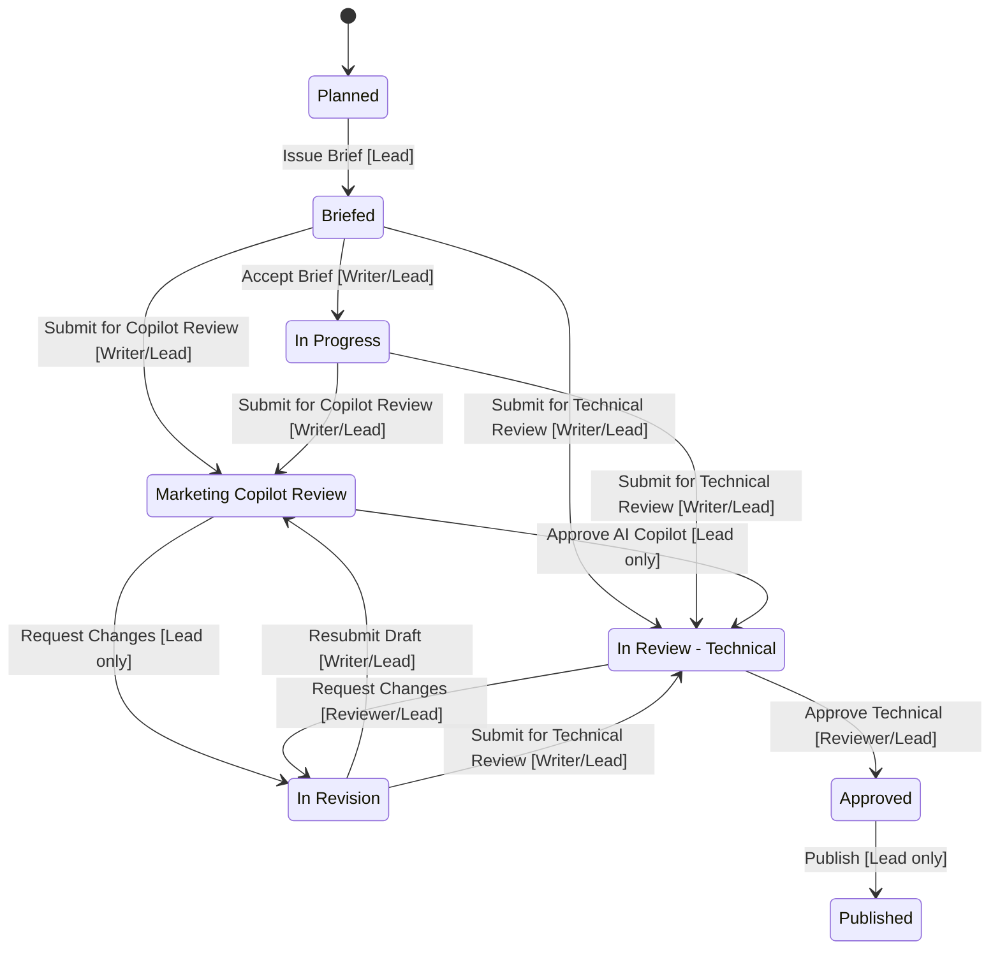

# ODA Marketing App — Comprehensive Audit Report

> Full code review of all doctypes, workflow, permissions, role visibility, AI engine, notifications, and documentation.

---

## Summary Dashboard

| Category | Critical | Medium | Low |
|:---|:---:|:---:|:---:|
| Workflow & State Machine | 3 | 2 | 1 |
| Role Permissions & Visibility | 2 | 3 | 1 |
| Data Model & DocType Fields | 1 | 2 | 2 |
| AI Copilot Engine | 1 | 3 | 1 |
| Notifications & Email | 0 | 2 | 1 |
| Documentation Drift | 0 | 1 | 2 |
| **Total** | **7** | **13** | **8** |

---

## 🔴 Critical Issues

### C1. `"Resubmit Draft"` always routes to `"Marketing Copilot Review"` — even when AI Copilot is OFF

**File**: [setup_fixtures.py](file:///home/user/frappe-bench/apps/oda_marketing/oda_marketing/setup_fixtures.py#L288-L290)

The workflow transition `In Revision → Resubmit Draft → Marketing Copilot Review` is hard-coded. When `enable_ai_copilot = 0`, the `sync_status_with_workflow()` in [content_item.py](file:///home/user/frappe-bench/apps/oda_marketing/oda_marketing/oda_marketing/doctype/content_item/content_item.py#L82-L86) silently rewrites `workflow_state` to `"In Review - Technical"`, bypassing the Frappe workflow engine. This means:
- The **Workflow document's transition history is inconsistent** (Frappe sees `Marketing Copilot Review`, but the document lands at `In Review - Technical`).
- There is no `"Resubmit Draft" → "In Review - Technical"` transition for the AI-off path. The writer should have a **separate, clean action** when Copilot is disabled.

> [!CAUTION]
> The silent `workflow_state` rewrite in `validate()` diverges from Frappe's workflow engine state tracking. This can cause issues with workflow history, audit trails, and `has_permission` checks that rely on the workflow state.

---

### C2. `trigger_ai_copilot()` whitelisted API has **no permission check**

**File**: [content_item.py](file:///home/user/frappe-bench/apps/oda_marketing/oda_marketing/oda_marketing/doctype/content_item/content_item.py#L368-L375)

```python
@frappe.whitelist()
def trigger_ai_copilot(docname):
    if frappe.db.exists("Content Item", docname):
        from oda_marketing.oda_marketing.ai_engine.runner import run_ai_review
        run_ai_review(docname)
```

Any authenticated user (even one without `Content Writer`, `Technical Reviewer`, or `Marketing Lead` roles) can call this endpoint and trigger an AI review on **any** Content Item. There is no `frappe.has_permission()` or role check.

---

### C3. `notify_writer_copilot_failed()` is defined but **never called**

**File**: [runner.py](file:///home/user/frappe-bench/apps/oda_marketing/oda_marketing/oda_marketing/ai_engine/runner.py#L90-L113)

This function constructs and sends a "COPILOT REVISION REQUIRED" email to the Content Writer when the AI score is below threshold. However, it is **never invoked** anywhere in the codebase. The `run_ai_review()` function handles the fail case at line 64 but does not call `notify_writer_copilot_failed()`.

---

### C4. `has_app_permission()` returns `True` for ALL users

**File**: [permissions.py](file:///home/user/frappe-bench/apps/oda_marketing/oda_marketing/permissions.py#L7-L8)

```python
def has_app_permission(user=None):
    return True
```

This means **every user** on the Frappe site (HR users, Accounts users, etc.) can see the "ODA Marketing" app in the Apps Switcher. It should check for at least one of `Marketing Lead`, `Content Writer`, `Technical Reviewer`, or `System Manager`.

---

### C5. Workspace shortcuts for `Marketing Settings` and `Env Variable` are visible to all roles

**File**: [oda_marketing.json](file:///home/user/frappe-bench/apps/oda_marketing/oda_marketing/oda_marketing/workspace/oda_marketing/oda_marketing.json#L42-L57)

The workspace JSON has **no `roles` array** defined (line 23: `"roles": []`). This means the entire workspace page — including the `Marketing Settings` and `Env Variable` shortcuts — is visible to everyone. Even though the DocType permissions will block access, this creates a **confusing UX**: users see links they cannot access.

---

### C6. `ai_reviews` Table field has **no read_only protection** for non-lead users

**File**: [content_item.json](file:///home/user/frappe-bench/apps/oda_marketing/oda_marketing/oda_marketing/doctype/content_item/content_item.json#L231-L236)

The `ai_reviews` child table (AI Copilot Review Audit History) is not set `read_only: 1` in the DocType JSON. A Content Writer with `write` permission on Content Item can technically **add, delete, or modify** rows in the AI review audit log.

---

### C7. `content_item.json` field_order is **missing `notes_section`** — orphaned Section Break

**File**: [content_item.json](file:///home/user/frappe-bench/apps/oda_marketing/oda_marketing/oda_marketing/doctype/content_item/content_item.json#L7-L37)

The `field_order` array does not include `notes_section` (the Section Break for "Notes & Working Draft Copy"). However, the field is defined at line 187. This means the section break exists but is **not positioned in the field order**, causing it to render at an unpredictable position in the form layout.

---

## 🟡 Medium Issues

### M1. `"Business Reviewer"` role is a ghost — partially referenced but never implemented

**References found**:
- [content_calendar.json](file:///home/user/frappe-bench/apps/oda_marketing/oda_marketing/oda_marketing/doctype/content_calendar/content_calendar.json#L135) — permission entry for `Business Reviewer` with `read: 1`
- [app-architecture-and-flow.md](file:///home/user/frappe-bench/apps/oda_marketing/app-architecture-and-flow.md#L85) — documented as a role
- [content_item_calendar.js](file:///home/user/frappe-bench/apps/oda_marketing/oda_marketing/oda_marketing/doctype/content_item/content_item_calendar.js#L15) — `"In Review - Business"` state mapping

**Not found**: No `Business Reviewer` permission entry in `content_item.json`, no `"In Review - Business"` workflow state, no workflow transitions for this role, no role creation in `setup_roles()`.

This is an incomplete implementation remnant — the `Business Reviewer` role and `In Review - Business` state are documented and partially referenced but never actually functional.

---

### M2. Content Calendar `content_calendar.js` — "View Content Items" button requires `docstatus === 1` (submitted) but the DocType is **not submittable**

**File**: [content_calendar.js](file:///home/user/frappe-bench/apps/oda_marketing/oda_marketing/oda_marketing/doctype/content_calendar/content_calendar.js#L6-L10)

```javascript
if (frm.doc.docstatus === 1) {
    frm.add_custom_button(...);
}
```

The `Content Calendar` DocType has no `is_submittable` flag set. `docstatus` will always be `0`, so the "View Content Items" button **never appears**.

---

### M3. `content_item.js` hides workflow buttons with `setTimeout(300ms)` — fragile and unreliable

**File**: [content_item.js](file:///home/user/frappe-bench/apps/oda_marketing/oda_marketing/oda_marketing/doctype/content_item/content_item.js#L44-L56)

Hiding/showing workflow action buttons via `setTimeout` + `clear_action_item` / `remove_inner_button` is timing-dependent. If the workflow action rendering takes longer (slow network, heavy page), the buttons may flash before being removed, or may not be removed at all.

---

### M4. `content_item.js` `apply_role_field_permissions` sets `revision_feedback_notes` read_only for writers, but the writer needs to fill it when using "Resubmit Draft"

**File**: [content_item.js](file:///home/user/frappe-bench/apps/oda_marketing/oda_marketing/oda_marketing/doctype/content_item/content_item.js#L101)

```javascript
// For Content Writer:
frm.set_df_property("revision_feedback_notes", "read_only", 1);
```

However, `validate_revision_notes()` in [content_item.py](file:///home/user/frappe-bench/apps/oda_marketing/oda_marketing/oda_marketing/doctype/content_item/content_item.py#L130-L132) requires `revision_feedback_notes` when transitioning **to** `In Revision`. Since only the **reviewer** triggers this transition, this is currently correct. But if the writer ever needs to see or update these notes, the UX is confusing — the field is read-only but `reqd: 1` when state is `In Revision` (line 112).

---

### M5. `runner.py` uses `doc.save(ignore_permissions=True)` after `doc.flags.ignore_workflow = True` — bypasses all validations

**File**: [runner.py](file:///home/user/frappe-bench/apps/oda_marketing/oda_marketing/oda_marketing/ai_engine/runner.py#L73-L78)

The AI runner directly sets `workflow_state` via `db_set`, then saves with `ignore_permissions=True` and `ignore_workflow=True`. This bypasses:
- Workflow transition validation
- Permission checks
- The `validate_copilot_score_gatekeeper()` validation

While intentional for the automated AI agent, this creates an unguarded pathway where any code that calls `run_ai_review()` can force-transition the document to any state.

---

### M6. `evaluator_agent.py` logs every API response to `Error Log` via `frappe.log_error()`

**File**: [evaluator_agent.py](file:///home/user/frappe-bench/apps/oda_marketing/oda_marketing/oda_marketing/ai_engine/evaluator_agent.py#L73)

```python
frappe.log_error(f"DEBUG OpenAI JSON Response: {raw_content}")
```

This logs **every successful** AI response as an error. In production, this will flood the Error Log with non-error entries, making it hard to spot real issues.

---

### M7. `sla_due_date` is calculated server-side but also listed in `validate_metadata_edit_permissions` as protected

**File**: [content_item.py](file:///home/user/frappe-bench/apps/oda_marketing/oda_marketing/oda_marketing/doctype/content_item/content_item.py#L64)

`sla_due_date` is auto-calculated from `planned_publish_date - lead_days`. It's also in the `metadata_fields` protection list. If a Lead changes `planned_publish_date`, the `sla_due_date` auto-updates without issue. But if a non-lead user somehow triggers a recalculation (e.g., via API), the edit protection check would fail because the old and new `sla_due_date` values differ — even though the user didn't manually change it.

The `calculate_sla_due_date()` runs **before** `validate_metadata_edit_permissions()` would be checked in the `validate()` chain (line 16 vs line 13), but `validate_metadata_edit_permissions()` actually runs first (line 13). So the check happens on the pre-calculation value — this ordering is correct by accident but fragile.

---

### M8. No `list_view_settings.js` or `content_item_list.js` — list view has no custom formatting

The Content Item list view uses default Frappe rendering. There's no indicator color mapping, row formatting, or status badges in the list view. Combined with the fact that `content_item.json` has `states` defined (with colors), the list view will show colored indicators, but there's no custom list view script for additional formatting like conditional row colors or priority badges.

---

### M9. Sidebar setup uses `Custom DocPerm` on `"Workspace Sidebar"` — non-standard approach

**File**: [setup_fixtures.py](file:///home/user/frappe-bench/apps/oda_marketing/oda_marketing/setup_fixtures.py#L484-L512)

The `setup_workspace_sidebar()` function creates `Custom DocPerm` entries for `"Workspace Sidebar"`, which is a Frappe core DocType. Frappe's workspace system uses the `roles` array in the Workspace JSON, not `Custom DocPerm`, to control visibility. This sidebar permission approach may not work as expected and could break on Frappe upgrades.

---

### M10. `content_item.json` — `ai_reviews` Table field has no `read_only` flag and no `cannot_add_rows` / `cannot_delete_rows` protection

Content Writer and Technical Reviewer roles have `write: 1` on Content Item. Without explicit `read_only: 1` or `cannot_add_rows: 1` on the child table field, these users could theoretically manipulate the AI review audit trail.

---

## 🟢 Low Priority / Cosmetic Issues

### L1. `content_item_calendar.js` references `"In Review - Business"` state that doesn't exist in the workflow

**File**: [content_item_calendar.js](file:///home/user/frappe-bench/apps/oda_marketing/oda_marketing/oda_marketing/doctype/content_item/content_item_calendar.js#L15)

The style map includes `"In Review - Business": "purple"` but this state is never used. It's harmless (just dead configuration) but creates confusion.

---

### L2. `content_item_calendar.js` references `"Marketing Copilot Review"` state is **missing** from the style map

While `"In Review - Business"` (unused) is in the style map, the actually-used `"Marketing Copilot Review"` state has no calendar style entry. Items in this state will render without a specific color indicator.

---

### L3. `content_item.json` — `"Marketing Copilot Review"` state is missing from the `states` array

**File**: [content_item.json](file:///home/user/frappe-bench/apps/oda_marketing/oda_marketing/oda_marketing/doctype/content_item/content_item.json#L300-L329)

The `states` array defines indicator colors for `Planned`, `Briefed`, `In Progress`, `In Review - Technical`, `In Revision`, `Approved`, `Published` — but **not** `Marketing Copilot Review`. Items in this state won't have a colored indicator pill.

---

### L4. `setup_fixtures.py` `seed_demo_data()` uses `db_set("workflow_state")` which doesn't trigger workflow engine

**File**: [setup_fixtures.py](file:///home/user/frappe-bench/apps/oda_marketing/oda_marketing/setup_fixtures.py#L417)

Demo items are fast-forwarded to target states by directly setting `workflow_state` via `db_set`. This skips all validations, email triggers, and notification hooks. Not a bug per se, but may cause confusion if seeded data is used for demo/testing.

---

### L5. `app-architecture-and-flow.md` documents `"In Review - Business"` and `"reviewer_business"` which don't exist in the implementation

The architecture doc describes a Business Review stage and Business Reviewer role that were never implemented. This creates confusion for new developers or stakeholders reading the documentation.

---

### L6. `content_item.json` has `index_web_pages_for_search` not explicitly set

For a document type that contains potentially sensitive enterprise content, having it indexed for web search could be a concern. It defaults to `0` when not set, so this is benign.

---

### L7. `run_setup()` does not call `setup_test_users()` — test users require separate manual setup

**File**: [setup_fixtures.py](file:///home/user/frappe-bench/apps/oda_marketing/oda_marketing/setup_fixtures.py#L540-L548)

```python
def run_setup():
    setup_roles()
    setup_email_templates_and_settings()
    setup_workflow()
    setup_kanban_board()
    setup_workspace_sidebar()
    setup_desktop_icon()
```

The `setup_test_users()` function exists but is not called by `run_setup()`. This is likely intentional (don't create test users in production), but there's no `run_dev_setup()` or similar for dev environments.

---

### L8. `Env Variable` DocType uses `index_web_pages_for_search: 1` — secrets could be indexed

**File**: [env_variable.json](file:///home/user/frappe-bench/apps/oda_marketing/oda_marketing/oda_marketing/doctype/env_variable/env_variable.json#L51)

While the `value` field is a `Password` type (encrypted), the `variable_name` and `description` fields could appear in web page search results if web indexing is enabled on the site.

---

## Role Visibility Matrix (Current State)

| Feature / DocType | Marketing Lead | Content Writer | Technical Reviewer | Business Reviewer | Other Desk Users |
|:---|:---:|:---:|:---:|:---:|:---:|
| **App in Switcher** | ✅ | ✅ | ✅ | ✅ | ⚠️ Visible (bug C4) |
| **Workspace Page** | ✅ | ✅ | ✅ | ✅ | ⚠️ Visible (bug C5) |
| **Content Item — List** | All items | Own items only | Assigned items only | ❌ No permission | ❌ |
| **Content Item — Create** | ✅ | ❌ Blocked | ❌ Blocked | ❌ | ❌ |
| **Content Item — Write** | ✅ All fields | ✅ Attachments only | ✅ Feedback only | ❌ | ❌ |
| **Content Calendar** | ✅ Full | 🔒 Read-only | 🔒 Read-only | 🔒 Read-only | ❌ |
| **Marketing Settings** | ✅ Full | ❌ Hidden (fixed) | ❌ Hidden | ❌ Hidden | ❌ |
| **Env Variable** | ✅ Full | ❌ | ❌ | ❌ | ❌ |
| **AI Review Audit Log** | ✅ View + Admin | ⚠️ Can edit (bug C6) | ⚠️ Can edit (bug C6) | ❌ | ❌ |

---

## Workflow State Machine (Current)



> [!WARNING]
> When AI Copilot is **OFF**, both "Submit for Copilot Review" and "Resubmit Draft" actions still route to `Marketing Copilot Review` state in Frappe's workflow engine. The redirect to `In Review - Technical` happens in Python `validate()`, not in the workflow definition.

---

## Recommended Priority Fixes

### Immediate (Critical)
1. **C2**: Add `frappe.has_permission("Content Item", "write", doc=docname)` check in `trigger_ai_copilot()`
2. **C4**: Implement role check in `has_app_permission()` 
3. **C5**: Add `roles` array to workspace JSON to restrict visibility
4. **C6**: Set `read_only: 1` on `ai_reviews` field in `content_item.json`

### Short-term (Medium)
5. **M2**: Remove or fix the `docstatus === 1` check in `content_calendar.js`
6. **M6**: Change `frappe.log_error()` to `frappe.logger().debug()` for successful API responses
7. **M1**: Either fully implement Business Reviewer or remove all references
8. **C1**: Add explicit `"Resubmit Draft" → "In Review - Technical"` transition for the AI-off path

### Cleanup
9. **L1/L2**: Fix calendar view style map entries
10. **L3**: Add `Marketing Copilot Review` to `content_item.json` states array
11. **L5**: Update `app-architecture-and-flow.md` to reflect current implementation
12. **C3**: Either call `notify_writer_copilot_failed()` or remove it


# Fix All Audit Issues + SLA Due Date Visibility

Fix all 28 identified issues from the audit report, plus the SLA due date visibility bug reported by the user.

## User Review Required

> [!IMPORTANT]
> **Business Reviewer role**: The audit found a partially-implemented `Business Reviewer` role referenced in `content_calendar.json`, `content_item_calendar.js`, and `app-architecture-and-flow.md` but never functional. The plan removes all these dead references. If you want the Business Reviewer role implemented instead, please let me know.

## Proposed Changes

### Permissions & Security

#### [MODIFY] [permissions.py](file:///home/user/frappe-bench/apps/oda_marketing/oda_marketing/permissions.py)
- **C4**: Change `has_app_permission()` to check user has at least one of `Marketing Lead`, `Content Writer`, `Technical Reviewer`, or `System Manager` role.

#### [MODIFY] [content_item.py](file:///home/user/frappe-bench/apps/oda_marketing/oda_marketing/oda_marketing/doctype/content_item/content_item.py)
- **C2**: Add `frappe.has_permission("Content Item", "write", doc=docname)` check in `trigger_ai_copilot()`.
- **C3**: Call `notify_writer_copilot_failed()` from `runner.py` when AI score is below threshold (move the call to runner.py).
- **M7**: Reorder `validate()` to run `calculate_sla_due_date()` **after** `validate_metadata_edit_permissions()`, and exclude `sla_due_date` from the protected metadata fields list since it's auto-calculated.

---

### Workflow & State Machine

#### [MODIFY] [setup_fixtures.py](file:///home/user/frappe-bench/apps/oda_marketing/oda_marketing/setup_fixtures.py)
- **C1**: Add explicit `In Revision → Submit for Technical Review → In Review - Technical` transitions (already exists at lines 292-294). Add a **new** `In Revision → Resubmit for Review → In Review - Technical` transition for the AI-off path so `content_item.py` doesn't need to silently rewrite workflow_state.
  
  Actually, looking again at the existing transitions, lines 292-294 already define `In Revision → Submit for Technical Review → In Review - Technical`. The issue is that `Resubmit Draft` always goes to `Marketing Copilot Review`. The fix: when AI Copilot is **off**, the JS should hide "Resubmit Draft" and show "Submit for Technical Review" from `In Revision`. When AI is **on**, show "Resubmit Draft" and hide "Submit for Technical Review" from `In Revision`. This is a JS-side button visibility fix, not a workflow definition change.

---

### Data Model & DocType Fields

#### [MODIFY] [content_item.json](file:///home/user/frappe-bench/apps/oda_marketing/oda_marketing/oda_marketing/doctype/content_item/content_item.json)
- **C6/M10**: Set `read_only: 1` on the `ai_reviews` Table field.
- **C7**: Add `notes_section` to the `field_order` array (before `notes`).
- **L3**: Add `Marketing Copilot Review` to the `states` array with `"color": "Purple"`.
- **SLA Due Date**: The `sla_due_date` field is positioned inside `column_break_2` section. Move it to a more prominent location — add it to the main metadata area (before `column_break_1` or after `planned_publish_date`). Also ensure it appears in list view for all roles.

#### [MODIFY] [content_calendar.json](file:///home/user/frappe-bench/apps/oda_marketing/oda_marketing/oda_marketing/doctype/content_calendar/content_calendar.json)
- **M1**: Remove the `Business Reviewer` permission entry (lines 127-138).

#### [MODIFY] [env_variable.json](file:///home/user/frappe-bench/apps/oda_marketing/oda_marketing/oda_marketing/doctype/env_variable/env_variable.json)
- **L8**: Set `index_web_pages_for_search: 0`.

---

### Client-Side JS

#### [MODIFY] [content_item.js](file:///home/user/frappe-bench/apps/oda_marketing/oda_marketing/oda_marketing/doctype/content_item/content_item.js)
- **C1/M3**: Improve workflow button visibility logic:
  - When AI Copilot is **ON**: hide "Submit for Technical Review" for non-leads in states `Briefed/In Progress/In Revision`, and show "Resubmit Draft" in `In Revision`.
  - When AI Copilot is **OFF**: hide "Submit for Copilot Review", "Resubmit Draft", and "Approve AI Copilot" in all states. Show "Submit for Technical Review" in `In Revision`.
- **SLA Due Date**: Ensure `sla_due_date` is NOT in the read-only list for viewing (it should be visible to all but read-only for non-leads — it already is in the `metadata_fields` list with `read_only: 1` in the JSON).

#### [MODIFY] [content_calendar.js](file:///home/user/frappe-bench/apps/oda_marketing/oda_marketing/oda_marketing/doctype/content_calendar/content_calendar.js)
- **M2**: Remove the `docstatus === 1` check so the button always shows.

#### [MODIFY] [content_item_calendar.js](file:///home/user/frappe-bench/apps/oda_marketing/oda_marketing/oda_marketing/doctype/content_item/content_item_calendar.js)
- **L1**: Remove `"In Review - Business"` from style map.
- **L2**: Add `"Marketing Copilot Review": "info"` to style map.

---

### AI Engine

#### [MODIFY] [runner.py](file:///home/user/frappe-bench/apps/oda_marketing/oda_marketing/oda_marketing/ai_engine/runner.py)
- **C3**: Call `notify_writer_copilot_failed(doc, score, feedback)` when score < passing_score.

#### [MODIFY] [evaluator_agent.py](file:///home/user/frappe-bench/apps/oda_marketing/oda_marketing/oda_marketing/ai_engine/evaluator_agent.py)
- **M6**: Change `frappe.log_error()` to `frappe.logger().debug()` for successful AI responses.

---

### Workspace

#### [MODIFY] [oda_marketing.json](file:///home/user/frappe-bench/apps/oda_marketing/oda_marketing/oda_marketing/workspace/oda_marketing/oda_marketing.json)
- **C5**: Add `roles` array restricting workspace visibility to `System Manager`, `Marketing Lead`, `Content Writer`, `Technical Reviewer`.

---

### Documentation

#### [MODIFY] [app-architecture-and-flow.md](file:///home/user/frappe-bench/apps/oda_marketing/app-architecture-and-flow.md)
- **L5/M1**: Remove all references to `Business Reviewer`, `reviewer_business`, and `In Review - Business`. Update the workflow states list and permission matrix to match the current implementation.

---

## Verification Plan

### Automated Tests
```bash
bench --site marketing.localhost run-tests --app oda_marketing
```

### Manual Verification
- Run `bench --site marketing.localhost migrate` to sync all DocType changes.
- Verify SLA due date is visible on Content Item form for all roles.


# Fix All Audit Issues — Task Checklist

- [ ] **permissions.py** — C4: `has_app_permission()` role check
- [ ] **content_item.py** — C2: permission check in `trigger_ai_copilot()`, M7: reorder validate + exclude sla_due_date from protected fields
- [ ] **runner.py** — C3: call `notify_writer_copilot_failed()`
- [ ] **evaluator_agent.py** — M6: change `log_error` to `logger().debug()`
- [ ] **content_item.json** — C6/M10: `ai_reviews` read_only, C7: `notes_section` in field_order, L3: `Marketing Copilot Review` state, SLA due date position
- [ ] **content_item.js** — C1/M3: workflow button visibility, SLA due date visible
- [ ] **content_item_calendar.js** — L1: remove Business state, L2: add Copilot Review state
- [ ] **content_calendar.json** — M1: remove Business Reviewer permission
- [ ] **content_calendar.js** — M2: remove docstatus check
- [ ] **env_variable.json** — L8: disable web indexing
- [ ] **oda_marketing.json** — C5: add roles array
- [ ] **setup_fixtures.py** — Clean up Business Reviewer references if any
- [ ] **app-architecture-and-flow.md** — L5/M1: remove Business Reviewer docs
- [ ] **Migrate & Test** — run migrate + tests
